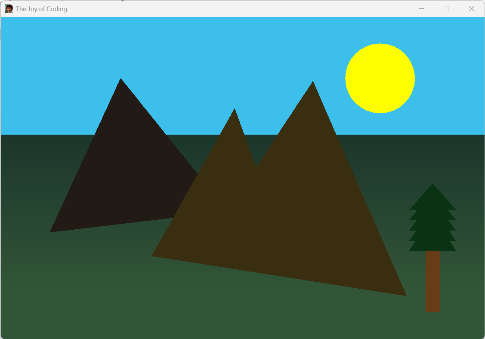

# The Joy of Coding
Project for learning how to create a Bob Ross style illustration using 2D graphics and launching via Swing:

It is a Swing application that launches a window and draws geometric shapes with different colors and mixes. Tutorial comes from **[Learn Code By Gaming](https://learncodebygaming.com)** ([video tutorial](https://youtu.be/IyBsWymfqms)).
